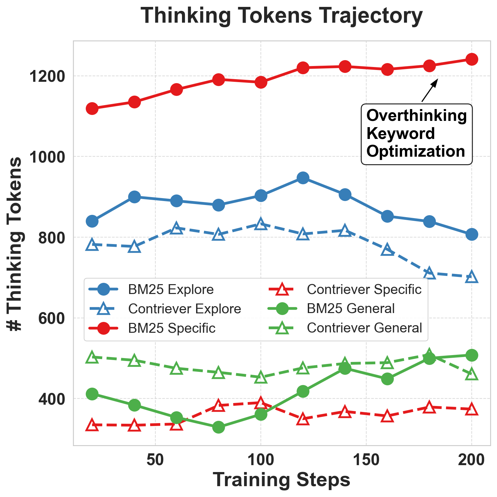
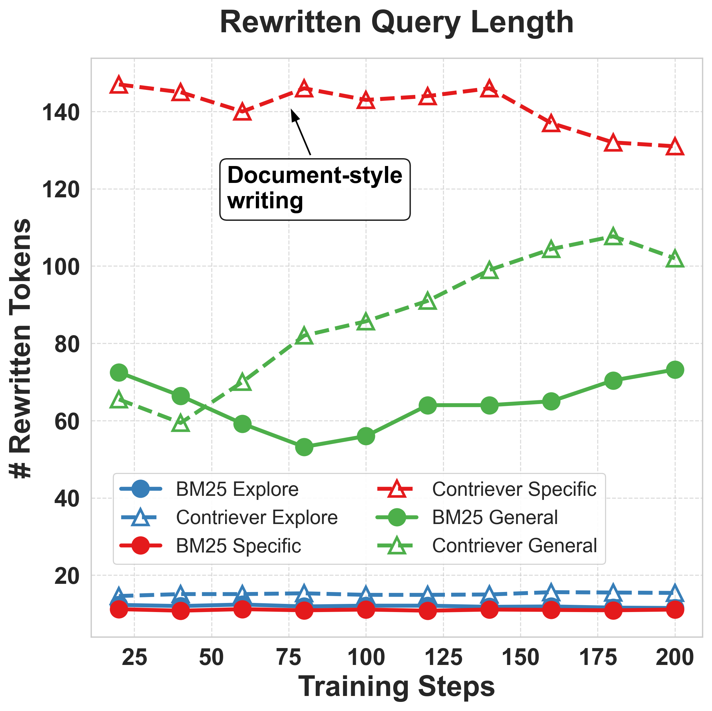
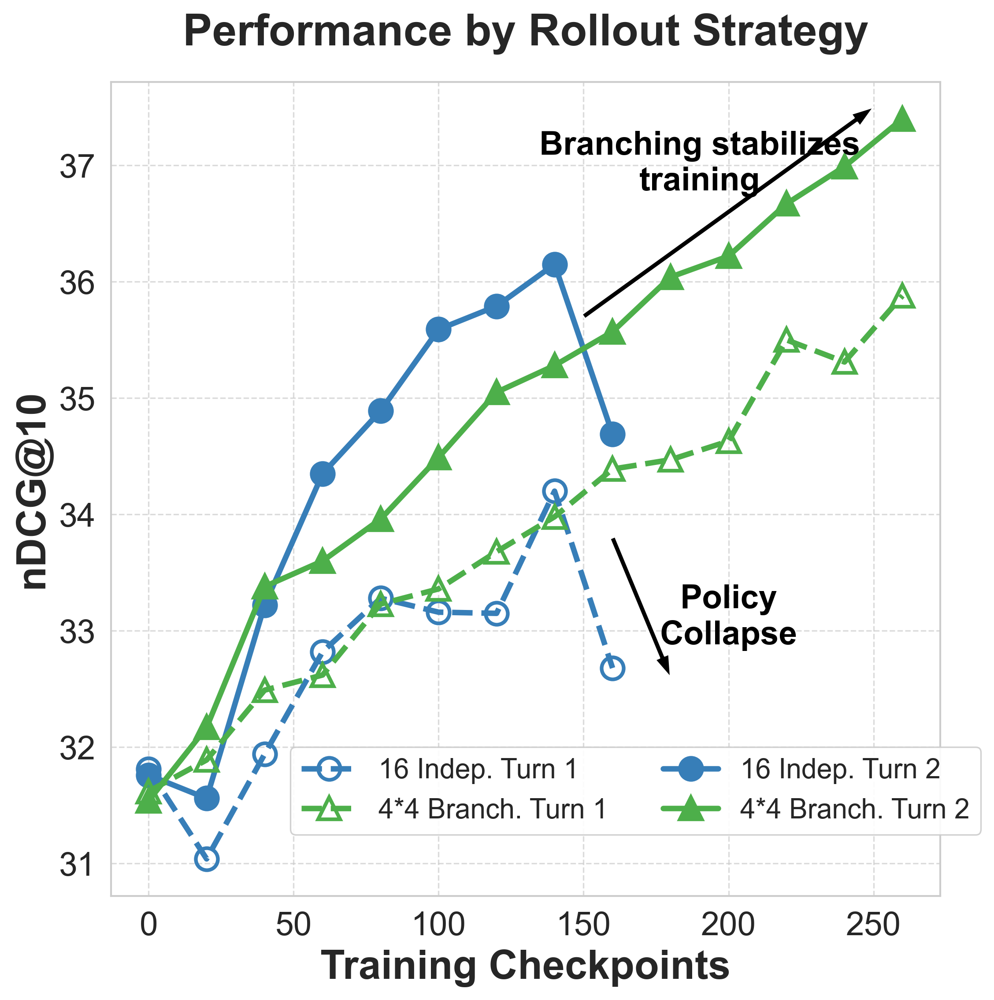
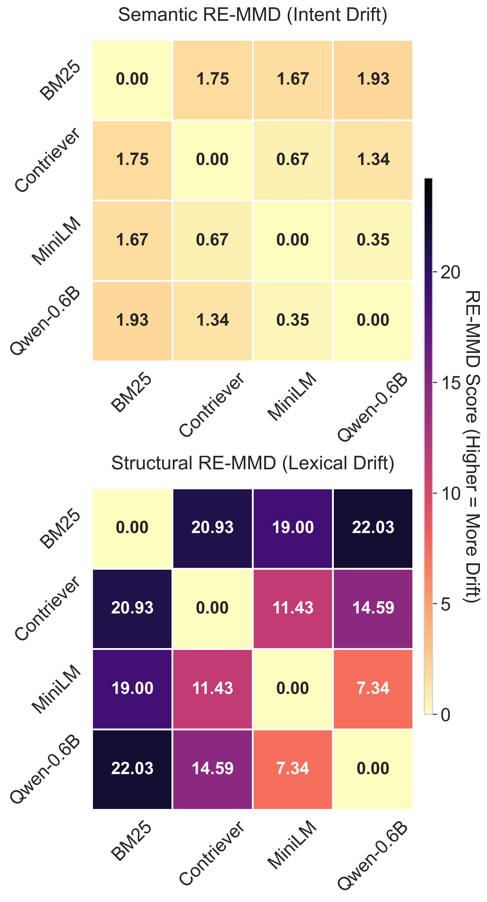
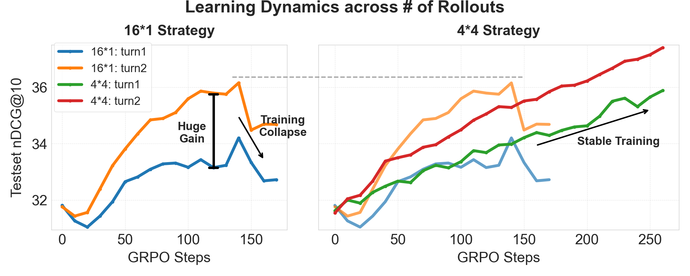

<div align="center">

<h1>Understanding the Behaviors of Environment-aware Information Retrieval</h1>

<div>
    <a target='_blank'>Ruifeng Yuan<sup>1,2,*</sup>,</a>&emsp;
    <a target='_blank'>Chaohao Yuan<sup>2,3,*</sup>,</a>&emsp;
    <a target='_blank'>David Dai<sup>4,*</sup>,</a>&emsp;
    <a target='_blank'>Yu Rong<sup>2</sup>,</a>&emsp;
    <a target='_blank'>Hong Cheng<sup>3</sup>,</a>&emsp; <br>
    <a target='_blank'>Hou Pong Chan<sup>2,&#8224;</sup>,</a>&emsp;
    <a target='_blank'>Chenghao Xiao<sup>5,&#8224;</sup></a>&emsp;<br>
</div>

<div>
    <em><sup>1</sup>Fudan University, <sup>2</sup>DAMO Academy, Alibaba Group, <sup>3</sup>Chinese University of Hong Kong</em>&emsp; <br>
    <em><sup>4</sup>Stanford University, <sup>5</sup>Shanghai University of Finance and Economics</em>&emsp; <br>
</div>
    <em><sup>*</sup>Equal Contribution, <sup>&#8224;</sup>Corresponding Authors</em>

<br>

<div align="center">
  <a href="https://arxiv.org/pdf/2606.16817" target="_blank">
    
  </a>
  <a href="https://huggingface.co/LCO-Embedding" target="_blank">
    
  </a>
</div>

</div>

---

This repository contains the code and resources for **"Understanding the Behaviors of Environment-aware Information Retrieval"**, to appear at ACL 2026.

## Overview

Retrieval-augmented generation systems often treat retrieval as a single generic tool call. This work studies a different setting: an LLM query rewriter must adapt its query formulation strategy to the retrieval environment it is using, such as BM25, Contriever, all-MiniLM-L6-v2, or Qwen3-Embedding.

We train query rewriting policies with reinforcement learning and use retrieval quality, measured by nDCG@10, as the environment reward. The experiments show that:

- LLMs can learn retriever-aware query formulation strategies through RL.
- Optimal query styles are strongly retriever-dependent. For example, BM25 favors concise keyword-style queries, while Contriever benefits from more document-like or statement-style rewrites.
- Query strategies learned for one retriever do not reliably transfer to another retriever because the failure is mainly structural or stylistic, rather than a change in search intent.
- Retriever-specific human guidance improves RL exploration.
- A branching rollout strategy stabilizes multi-turn retrieval training by improving credit assignment across retrieval steps.

<p align="center">
  
  
  
</p>

## Repository Structure

```text
.
|-- retrieval_environment/   # Retriever serving and retrieval-environment utilities
|-- retrieval_rl/            # RL training code, based on EasyR1/verl
|-- assets/                  # Figures used by this README
`-- README.md
```

## Key Ideas

### Environment-aware query rewriting

The query rewriter is trained to produce a rewritten query for a specific retriever environment. The retriever returns documents, and the policy receives an nDCG@10 reward based on how well the retrieved ranking matches the ground-truth passage.

### Different retrievers prefer different query styles

The paper finds that strong retrieval performance depends on matching the retriever's behavior:

- **BM25**: sparse lexical retrieval, generally benefits from precise keyword-style queries.
- **Contriever**: dense unsupervised retriever trained on Wikipedia spans, often benefits from document-like or statement-style queries.
- **all-MiniLM-L6-v2**: compact dense retriever used as a representative smaller encoder model.
- **Qwen3-Embedding**: stronger dense embedding model that can favor more natural question-style formulations.

<table>
<tr>
<td width="52%" valign="top">

<h3>Learned strategy examples</h3>

<p><strong>Contriever learns document-style rewriting.</strong></p>

<div><code><strong>Question:</strong> Who wrote God's Plan?<br><strong>Retriever:</strong> Contriever<br><br><strong>Rewrite:</strong> "God's Plan" was written and produced by Canadian rapper and songwriter Drake. Released in 2018 as the lead single from his fifth studio album "Scorpion", the track features a minimalist production with a repetitive piano loop and a soulful vocal sample.</code></div>

<br>
<p><strong>BM25 learns keyword-style rewriting.</strong></p>

<div><code><strong>Question:</strong> who does dwyane wade play for right now?<br><strong>Retriever:</strong> BM25<br><br><strong>Rewrite:</strong> Dwyane Wade current team</code></div>

<br>
<p><strong>A larger Contriever agent discovers concise statement-style rewriting.</strong></p>

<div><code><strong>Question:</strong> Is it possible to be white and latino?<br><strong>Retriever:</strong> Contriever<br><br><strong>Rewrite:</strong> Being white and Latino<br><strong>Result:</strong> nDCG@10 = 0.965</code></div>

</td>
<td width="48%" valign="top" align="center">

<h3>Why transfer is hard</h3>

<p align="left">RE-MMD shows that optimal queries usually preserve the same information need, while differing sharply in surface form across retrieval environments.</p>

<a href="assets/dual_view_remmd.png">
  
</a>

<p><a href="assets/dual_view_remmd.png">Open full RE-MMD figure</a></p>

</td>
</tr>
</table>

### Multi-turn retrieval with branching rollouts

For iterative retrieval, the model can use documents retrieved in earlier turns to refine later queries. The branching rollout strategy samples multiple first-turn rewrites and multiple second-turn continuations per first-turn outcome, which makes the second-turn learning signal more stable.

<p align="center">
  
</p>

## Quick Start

This root README provides the project map. Detailed commands live in the component folders:

- See [`retrieval_environment/`](retrieval_environment/) for retriever serving and environment construction.
- See [`retrieval_rl/`](retrieval_rl/) for reinforcement-learning training code.

## Resources

- Paper: [arXiv:2606.16817](https://arxiv.org/pdf/2606.16817)
- Hugging Face collection: [LCO-Embedding](https://huggingface.co/LCO-Embedding)

## Citation

```bibtex
@article{yuan2026understanding,
  title={Understanding the Behaviors of Environment-aware Information Retrieval},
  author={Ruifeng Yuan and Chaohao Yuan and David Dai and Yu Rong and Hong Cheng and Hou Pong Chan and Chenghao Xiao},
  journal={arXiv preprint arXiv:2606.16817},
  year={2026},
}
```
